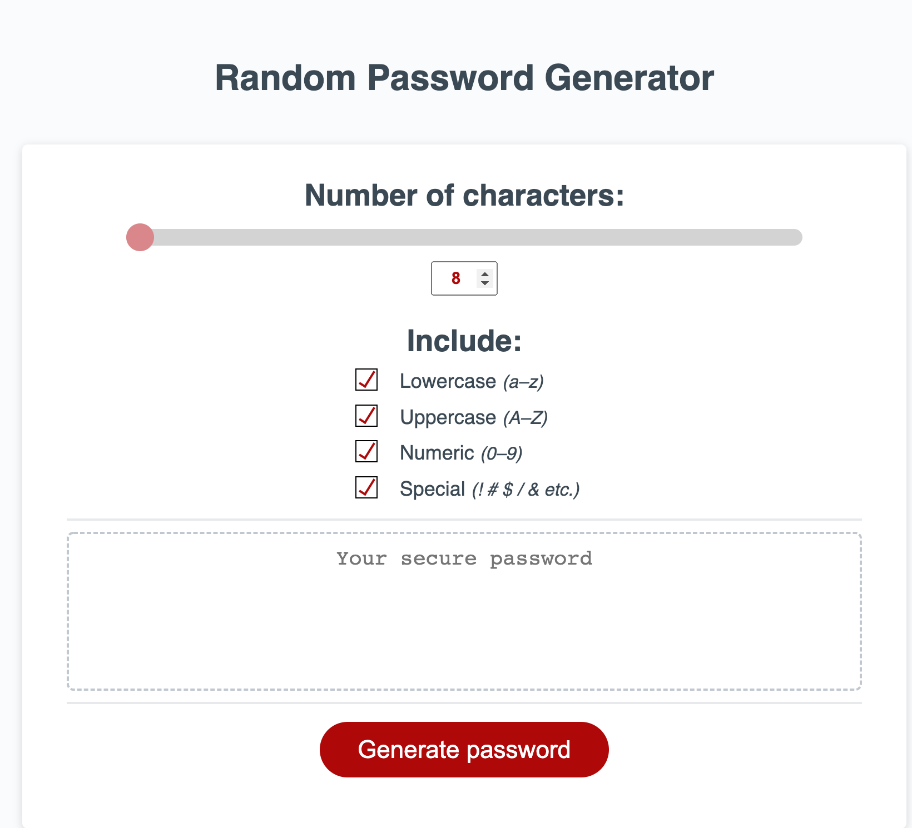
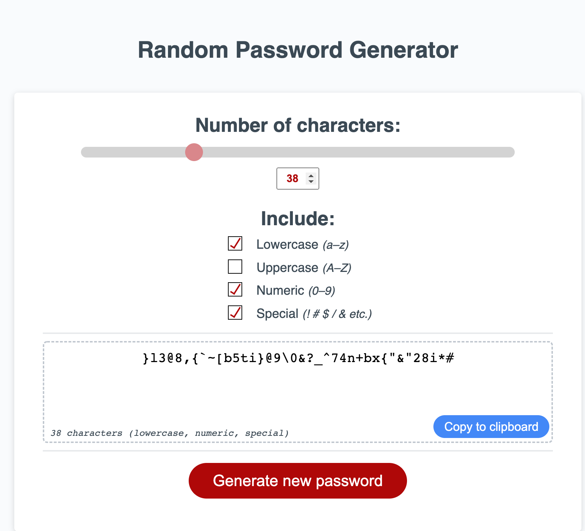
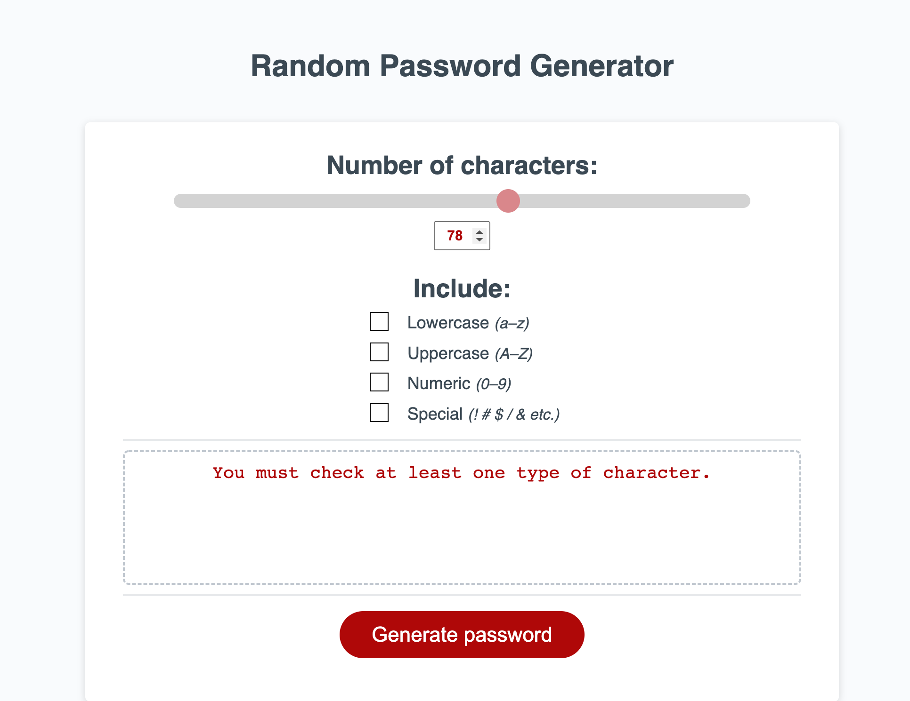

# Random Password Generator
## Noah Becker

### [Github repo](https://github.com/noah35becker/random-password-generator/)

### [Live web application](https://noah35becker.github.io/random-password-generator/)
 
************************************************************************

 
 

This code completes the weekly challenge for Module #3 in Columbia's Coding Bootcamp.

 

I have created a random password generator.

 

The user first selects a password length between 8–128 characters, using either the interactive slider or its corresponding numeric input.

- The slider and numeric input mutually update in real time
- The slider is animated, whether updated directly (by dragging the slider itself) or indirectly (by adjusting the numeric input)
- The numeric input is adjusted by either:
    - typing in a number
    - clicking the input's ↑/↓ arrows (which appear when it's in focus)
    - pressing the ↑/↓ arrows on the keyboard (while the input is in focus)
- The user's numeric input is thoroughly validated

 

The user then selects which types of characters they'd like to include in the generated password.

 

Lastly, the user clicks the "Generate password" button. A password appears that matches the specified criteria.

- All generated passwords are guaranteed to contain at least one of each selected character type
- If the user doesn't have any character types selected, an error message appears
- As long as password generation was successful (i.e. the user had at least one character type selected):
    - The "Generate password" button auto-updates to read "Generate new password"
    - The password's "stats" (# of characters, types of characters included) appear on screen
        - If the user begins to adjust settings in preparation for generating a new password, these stats, usefully, remain unchanged alongside the <em>current</em> password to which they apply
    - A "Copy to clipboard" button appears, which animates upon click

 

The web application uses a responsive layout that adapts to different viewports and devices.

 

I made use of multiple Git branches throughout the coding process. While this didn't serve any technical purpose—I am the only programmer on this project—it gave me another opportunity to practice observing a good Git workflow.

 

Below are final screenshots of the final version of the web application:

 
The application's initial state
 
 

 

 
The application showing a generated password
 
 

 

 
The application showing an error message
 
 

 

 

– Noah